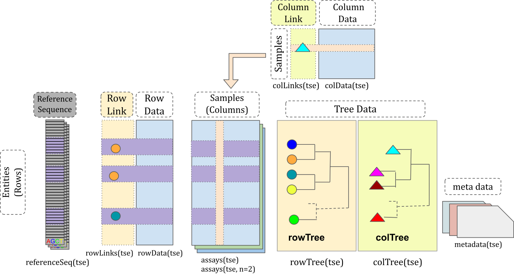

```{r}
#| label: setup
#| include: false

knitr::opts_chunk$set(
    collapse = TRUE,
    comment = "#>",
    warning = FALSE,
    message = FALSE
)
```

Authors:
    Tuomas Borman^[University of Turku, tvborm@utu.fi]
    <br/>
Last modified: 6 November, 2025.

 

## Overview

### Description

In microbiome research, there is an increasing demand for robust, transparent,
and reproducible computational methods. Bioconductor is well-positioned to to
fulfill this need by providing high-quality, open-source bioinformatics
software. At the core of Bioconductor are standardized data containers that
harmonize data management and enable interoperability across the ecosystem.

This workshop introduces the latest advances in microbiome analysis within
Bioconductor, focusing on the `r BiocStyle::Biocpkg("mia")`
(Microbiome Analysis) framework. The framework is built upon the
`r BiocStyle::Biocpkg("TreeSummarizedExperiment")` data container — the central
data structure in Bioconductor — and provides a comprehensive suite of
statistical tools for microbiome data science. It is continuously expanding with
new methods and offers native support for multi-table and hierarchical data,
while being computationally more efficient than previous approaches. These
features enable users to build modular and reproducible workflows for microbiome
analysis.

During the workshop, participants will gain hands-on experience with the
`r BiocStyle::Biocpkg("TreeSummarizedExperiment")` data container and the
`r BiocStyle::Biocpkg("mia")` framework through a practical case study. The
practicals cover common downstream analysis steps, from data import and
wrangling to diversity estimation, differential abundance analysis, and
visualization. After the workshop, participants will have the skills to continue
learning through the freely available
[Orchestrating Microbiome Analysis (OMA) online book](https://microbiome.github.io/OMA/docs/devel/),
which promotes best practices and supports adoption of the
ecosystem. Together, these resources foster scalable, transparent, and
community-driven microbiome data science. 

### Pre-requisites

To get most of the training session, you should meet the following
pre-requisites. 

- You have a basic understanding of R. You have written simple R scripts or used Quarto/RMarkdown documents.
- You have basic understanding on what the microbiome is.

If your time allows, we recommend to spend some time to explore beforehand
[Orchestrating Microbiome Analysis (OMA) online book](https://microbiome.github.io/OMA/docs/devel/).

### Participation

Participants are encouraged to ask questions throughout the workshop. The
session will follow
[a tutorial](https://microbiome.github.io/OMATutorials/),
with participants running the tutorial alongside the instructor.

### _R_ / _Bioconductor_ packages used

In this training session, we will cover a common methods and packages for
microbiome data science in `r BiocStyle::Biocpkg("SummarizedExperiment")`
ecosystem. We will have specific focus on `r BiocStyle::Biocpkg("mia")`,
which provides essential methods for conducting microbiome analysis.

### Time outline

| Activity                             | Time       |
|--------------------------------------|------------|
| Practicalities and background        | 30m        |
| Trained-guided live coding           | 60m        |
| Break                                | 30m        |
| Trained-guided live coding continues | 60m        |
| Time to try things out on your own   | 15m        |
| Questions, discussion and recap      | 15m        |
| **Total**                            | **3h 30m** |

### Learning goals and objectives

#### Questions

- What is _mia_ and _OMA_?
- How microbiome data science is conducted in `r BiocStyle::Biocpkg("SummarizedExperiment")` ecosystem?
- What benefits this new ecosystem have compared to previous approaches?

#### Objectives

- **Analyze and apply methods**:  Apply the `r BiocStyle::Biocpkg("SummarizedExperiment")` ecosystem to process and analyze microbiome data.
- **Create visualizations**: Generate and interpret visualizations.
- **Explore documentation**: Use the [OMA](https://microbiome.github.io/OMA/docs/devel) to explore additional tools and methods.

## Training session

### Background

- [Bioconductor](https://microbiome.github.io/outreach/bioconductor.html){preview-link="true"}
- [Data containers](https://microbiome.github.io/outreach/data_containers.html){preview-link="true"}

### Trained-guided live coding

#### Start your engines!

- Open your virtual machine.

#### Import data

- [Import](https://microbiome.github.io/outreach/import.html#/importers-and-converters){preview-link="true"}

Below, we import a dataset containing 60 samples from healthy controls and
patients with colorectal cancer (CRC). First, we import the data files.

```{r}
#| label: import_files
library(ape)

dir_name <- file.path("data", "GuptaA_2019")

# Abundance table
path <- file.path(dir_name, "taxonomy_abundance.csv")
assay <- read.csv(path, row.names = 1L)

# Taxonomy table
path <- file.path(dir_name, "taxonomy_table.csv")
taxonomy_table <- read.csv(path, row.names = 1L)

# Sample metadata
path <- file.path(dir_name, "sample_metadata.csv")
sample_metadata <- read.csv(path, row.names = 1L)

# Phylogeny
path <- file.path(dir_name, "phylogeny.tree")
phylogeny <- read.tree(path)
```

Then we create `r BiocStyle::Biocpkg("TreeSummarizedExperiment")` object.
**Note:** data types must be in specific format.

```{r}
#| label: create_tse
library(mia)
# Abundance table
assay <- assay |> as.matrix()
assay_list <- SimpleList(counts = assay)

# Taxonomy table and sample metadata
taxonomy_table <- taxonomy_table |> DataFrame()
sample_metadata <- sample_metadata |> DataFrame()

# Construct TreeSE
tse <- TreeSummarizedExperiment(
    assays = assay_list, 
    rowData = taxonomy_table,
    colData = sample_metadata,
    rowTree = phylogeny
)
```

#### Data container

`r BiocStyle::Biocpkg("TreeSummarizedExperiment")` extends
`r BiocStyle::Biocpkg("SummarizedExperiment")` class by adding a support for
microbiome-specific datatypes. These include, for instance, `rowTree` slot that
can be utilized to store phylogeny or any other hierarchical presentation of
the data. All slots derived from `r BiocStyle::Biocpkg("SummarizedExperiment")`
class are also available in `r BiocStyle::Biocpkg("TreeSummarizedExperiment")`,
providing full backward compatibility.

::: columns
::: column
{width=100%}
:::

::: column

```{r}
#| label: print_treese
tse
```

:::
:::

Slots can be accessed with dedicated accessor functions. For instance,
`colData` (sample metadata) can be accessed with `colData()` function.

```{r}
#| label: show_coldata
# Show only first five rows and columns
colData(tse)[1:5, 1:5]
```

The key functionality of data containers is that it does the sample and feature
bookkeeping for us. E.g., we can subset the data container without need for
worrying about sample matching between abundance table and sample metadata.

```{r}
#| label: subset
tse[1:10, c(1, 2)]
```

#### Data processing

Microbiome data has unique characteristics, meaning that dealing with such data
also poses unique challenges and approaches. The `r BiocStyle::Biocpkg("mia")`
package provides methods for performing common operations on microbiome data
within the `r BiocStyle::Biocpkg("SummarizedExperiment")` ecosystem.

##### Agglomeration

- [Agglomeration](https://microbiome.github.io/outreach/agglomeration.html)

Below, we agglomerate the data into all available taxonomy levels.

```{r}
#| label: agglomerate
tse <- agglomerateByRanks(tse)
```

At first glance, it might seem that nothing has changed. However, the
agglomerated data is stored in the `altExp` slot. This slot keeps track of the
sample mapping and stores different versions of the data.

We can access data agglomeration into the phylum level with the following
command:

```{r}
#| label: access_phyla
altExp(tse, "phylum")
```

The data looks similar to original data; only the number of rows has changed.
While we could store the phylum-level data in a separate variable, it's better
to keep it in the `altExp` slot, as it maintains consistent sample mapping for
us.

##### Transformation

- [Transformation](https://microbiome.github.io/outreach/transformation.html)

Microbiome data is typically zero-inflated, meaning that there are lots of
unobserved features. Let's first visualize the distribution of counts.

```{r}
#| label: show_histogram
library(miaViz)

plotHistogram(tse, assay.type = "counts")
```

As we can see, the distribution is highly right-skewed. To make the data more
normally-distributed, one can apply centered log-ratio transformation.

```{r}
#| label: transformation
tse <- transformAssay(
    tse,
    assay.type = "counts",
    method = "rclr",
    altexp = altExpNames(tse)
)
```

And when we visualize the distribution...

```{r}
#| label: visualize_clr
plotHistogram(tse, assay.type = "rclr")
```

... we see that the data is centered at zero and exhibit a distribution that is
more similar to normal than before.

Another common transformation is relative transformation.

```{r}
#| label: transformation_relative
tse <- transformAssay(
    tse,
    assay.type = "counts",
    method = "relabundance",
    altexp = altExpNames(tse)
)
```

We can access the transformed data with the following command:

```{r}
#| label: access_clr
assay(tse, "relabundance")[1:5, 1:5]
```

#### Community composition

A common visualizing technique is to summarize relative abundances of features
with a bar plot. Below, we visualize phyla. To compare controls and CRC patients
we can visualize the groups separately.

```{r}
#| label: plot_abundance
# Get phylum-level data
tse_phyla <- altExp(tse, "phylum")

# Create a bar plot
plotAbundance(
    tse_phyla,
    assay.type = "relabundance",
    col.var = "disease",
    facet.cols = TRUE,
    scales = "free_x"
)
```

From the figure, we observe that especially abundance of _Proteobacteria_ seems
to differ between the groups.

#### Alpha diversity

- [Alpha diversity](https://microbiome.github.io/outreach/alpha_diversity.html)

Alpha diversity indices can be calculated with `addAlpha()`.

```{r}
#| label: calculate_alpha
tse <- addAlpha(tse, assay.type = "counts")
```

The results are stored in `colData`. By default, the function returns a set of
indices that considers different aspects of diversity. Below, we visualize
Faith's diversity that assess the phylogenetic diversity of samples.

```{r}
#| label: visualize_alpha
plotBoxplot(tse, col.var = "faith_diversity", x = "disease")
```

From the figure, we can observe that CRC patients have more diverse microbiomes.
This may suggest that their gut is colonized by microbes that are not typically
present in a healthy gut.

#### Beta diversity

- [Ordination](https://microbiome.github.io/outreach/ordination.html)

A common beta diversity method is Principal Coordinate Analysis (PCoA) also
known as Multi-dimensional Scaling (MDS). It is unsupervised technique that can
be utilized to find patterns from the data.

```{r}
#| label: calculate_mds
tse <- addMDS(
    tse,
    assay.type = "counts",
    method = "unifrac"
)
```

PCoA results are commonly visualized with a scatter plot. Here we color points
based on disease.

```{r}
#| label: visualize_mds
library(scater)

plotReducedDim(tse, dimred = "MDS", colour_by = "disease")
```

We can see clear pattern. CRC patients' microbiome profile seem to differ from
healthy ones.

Next, we can utilize distance-based Redundancy Analysis (dbRDA). It is similar
to PCoA, but it specifically aims to assess how much variance or association is
accounted to sample covariates.

```{r}
#| label: rda
tse <- addRDA(
    tse,
    assay.type = "rclr",
    method = "euclidean",
    formula = x ~ disease + gender
)
```

Similarly, we can visualize the results with a biplot, specific type of scatter
plot.

```{r}
#| label: plot_rda
plotRDA(tse, dimred = "RDA", colour.by = "disease")
```

Feature loadings from the dbRDA analysis offer a first detailed look at the
features that are associated with CRC.

```{r}
#| label: rda_loadings
#| fig-width: 10
#| fig-height: 3
plotLoadings(tse, dimred = "RDA", ncomponents = 2L, layout = "lollipop")
```

For instance, _Prevotella copri_ is positively associated with the
first coordinate (or x-axis in our biplot). Because, CRC was also positively
associated with the first coordinate, this suggests association between higher
abundance of _Prevotella copri_ and CRC.

#### Differential abundance analysis (DAA)

- [Differential abundance analysis](https://microbiome.github.io/outreach/daa.html)

In differential abundance analysis, we can dig deeper on our analysis. We use
`r BiocStyle::Biocpkg("maaslin3")`, which uses linear models to assess
differentially abundant (and prevalent) features.

```{r}
#| label: calculate_daa
#| eval: false
#| message: false
#| warning: false
library(maaslin3)

res <- maaslin3(
    tse,
    assay.type = "counts",
    formula = ~ disease,
    normalization = "TSS",
    transform = "LOG",
    output = "maaslin3_output",
    verbosity = "ERROR"
)
```

The function generates different outputs. The output includes summary plot in
a directory that was specified by `output` argument.

```{r}
#| eval: false
#| label: visualize_daa
library(knitr)
file_path <- file.path("maaslin3_output", "figures", "summary_plot.png")
include_graphics(file_path)
```

The results confirm our dbRDA results. There are also other features that are
either differentially abundant or prevalent in study groups.

#### Online book

](figures/OMA_ss.png){width=500px}

## Questions, discussion and recap

1. Microbiome data science in `r BiocStyle::Biocpkg("SummarizedExperiment")` ecosystem
2. Scalable and computationally efficient
3. Integration of multi-table and multi-omics datasets

## Thank you for your time!

**Join us!**

- Online book: [microbiome.github.io/OMA](https://microbiome.github.io/OMA/docs/devel/)
- Discussion forums: [github.com/microbiome/OMA/discussions](https://github.com/microbiome/OMA/discussions) and Bioconductor Zulip

 

## Session information

```{r}
#| label: session_info

sessionInfo()
```

## References
