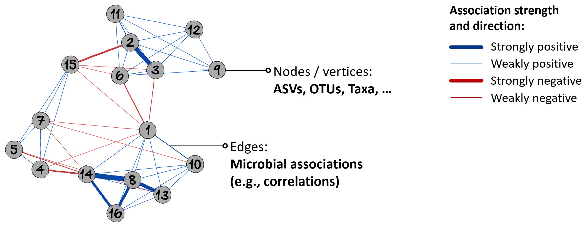
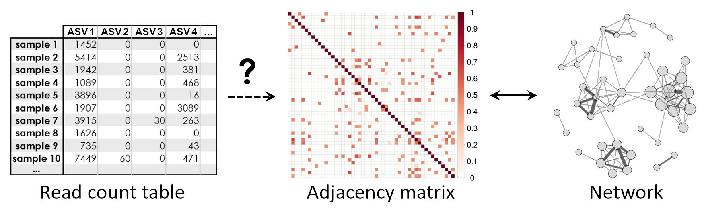

    
```{r, include = FALSE}
knitr::opts_chunk$set(
    collapse = TRUE,
    comment = "#>"
)
```

Authors:
    Tuomas Borman,
    Pande Erawijantari,
    Giulio Benedetti,
    Stefanie Peschel,
    Leo Lahti.
<br/>
Last modified: 16 September, 2024.


## Overview

### Description

This tutorial introduces the latest advances in Bioconductor tools and data
structures supporting microbiome analysis. We will show how this can enhance
interoperability across omics and walk through a typical microbiome data
science workflow. You will learn from active developers how to access open
microbiome data resources, utilize optimized data structures, assess community
diversity and composition, integrate taxonomic and functional hierarchies,
and visualize microbiome data. We will follow the online book
[“Orchestrating Microbiome Analysis with Bioconductor”](https://microbiome.github.io/OMA/docs/devel/) and Bioconductor
SummarizedExperiment framework, supporting optimized analysis and integration
of hierarchical, multi-domain microbiome data. Participants are encouraged to
install the latest versions of R and Bioconductor.

### Pre-requisites

* Basic knowledge of R coding
* Understanding of microbiome research

If your time allows, we recommend to spend some time to explore beforehand
[Orchestrating Microbiome Analysis (OMA) online book](https://microbiome.github.io/OMA/docs/devel/).

### Participation

We have instructor-led demonstrations where participants are expected to follow
along. Questions are encouraged at any time during the workshop.

It is preferred to use your own laptop. You can find help for installation from
[here](https://microbiome.github.io/OMA/docs/devel/pages/training.html).
There are also available [pre-installed virtual machines](https://workshop.bioconductor.org/)
by Galaxy/Bioconductor. (Under "EUROBIOC2024" tab, session called "Package Demo: mia")

### _R_ / _Bioconductor_ packages used

In this workshop, we will focus on
[the _mia_ package](https://bioconductor.org/packages/devel/bioc/html/mia.html),
which is designed for microbiome data science. The _mia_ package provides
essential tools for analyzing microbiome data using the
_SummarizedExperiment_ framework.

Additionally, we will cover [NetCoMi](https://github.com/stefpeschel/NetCoMi)
and [iSEEtree](https://www.bioconductor.org/packages/devel/bioc/html/iSEEtree.html)
in network and interactive data exploration session, respectively.

### Time outline

| Activity                                              | Time |
|-------------------------------------------------------|------|
| Bioconductor resources for microbiome data science    | 30m  |
| Analysis of community diversity and composition       | 30m  |
| Microbiome data integration                           | 30m  |
| Coffee break                                          | 30m  |
| Microbial network analysis                            | 30m  |
| Interactive microbiome data exploration with iSEEtree | 30m  |
| Recap and Q&A                                         | 30m  |

### Workshop goals and objectives

#### Learning goals

- **Methods for microbiome analysis**: Learn to harness _SummarizedExperiment_ ecosystem in your project.

- **Data structure**: Understand how to utilize the _TreeSummarizedExperiment_ class for effective microbiome data analysis.

- **Access resources**: Get familiar with additional tools and resources, including [the OMA online book](https://microbiome.github.io/OMA/docs/devel).

#### Learning objectives

- **Analyze and apply methods**:  Apply the framework to process and analyze microbiome data.

- **Visualize data**: Generate and interpret common graphs for microbiome data

- **Explore documentation**: Use the [OMA](https://microbiome.github.io/OMA/docs/devel) to explore additional tools and methods.

## Workshop

## Introduction

In this workflow, we demonstrate how to analyze data from publicly available
microbiome resources using Bioconductor methods. We will cover essential data
wrangling steps, explore alpha and beta diversity metrics, and introduce the
fundamentals of data integration and microbial network analysis. Additionally,
we will explore how to utilize the tools through a graphical interface.

## Bioconductor resources for microbiome data science

### Load packages

First, we load the required packages into the session. The following script
ensures that any packages not already installed are automatically installed.

```{r setup, message=FALSE}
# List of packages that we need
packages <- c(
    "ComplexHeatmap",
    "curatedMetagenomicData",
    "dplyr",
    "ggsignif",
    "iSEEtree",
    "mia",
    "miaViz",
    "NetCoMi",
    "scater",
    "shadowtext",
    "patchwork",
    "scater",
    "SpiecEasi",
    "tidyr"
    )

# Get packages that are already installed
packages_already_installed <- packages[ packages %in% installed.packages() ]
# Get packages that need to be installed
packages_need_to_install <- setdiff( packages, packages_already_installed )

# Install GitHub packages
if( "SpiecEasi" %in% packages_need_to_install ){
    # SpiecEasi must be installed from "latentcor" branch
    devtools::install_github("zdk123/SpiecEasi", force = TRUE, ref = "latentcor")
    # Remove from installation list
    packages_need_to_install <- packages_need_to_install[ !packages_need_to_install %in% "SpiecEasi" ]
}
if( "SPRING" %in% packages_need_to_install ){
    devtools::install_github("GraceYoon/SPRING")
    # Remove from installation list
    packages_need_to_install <- packages_need_to_install[ !packages_need_to_install %in% "SPRING" ]
}
if( "NetCoMi" %in% packages_need_to_install ){
    # NetCoMi must be installed from "TSE" branch
    devtools::install_github(
        "stefpeschel/NetCoMi", force = TRUE, ref = "TSE",
        dependencies = c("Depends", "Imports", "LinkingTo"),
        repos = c("https://cloud.r-project.org/", BiocManager::repositories()))
    # Remove from installation list
    packages_need_to_install <- packages_need_to_install[ !packages_need_to_install %in% "NetCoMi" ]
}

# Loads BiocManager into the session. Install it if it is not already installed.
if( !require("BiocManager") ){
    install.packages("BiocManager")
    library("BiocManager")
}

# If there are packages that need to be installed, installs them with BiocManager
# Updates old packages.
if( length(packages_need_to_install) > 0 ) {
    install(version = "devel")
    install(packages_need_to_install, ask = FALSE, update = FALSE)
}

# Load all packages into session. Stop if there are packages that were not
# successfully loaded
pkgs_not_loaded <- !sapply(packages, require, character.only = TRUE)
pkgs_not_loaded <- names(pkgs_not_loaded)[ pkgs_not_loaded ]
if( length(pkgs_not_loaded) > 0 ){
    stop(
        "Error in loading the following packages into the session: '",
        paste0(pkgs_not_loaded, collapse = "', '"), "'")
}
```

If you encountered an error, install packages manually.

### Importing data

There are several openly available datasets listed in [OMA](https://microbiome.github.io/OMA/docs/devel/pages/import.html#sec-example-data). In
this workflow, we will retrieve data from the curatedMetagenomicData resource.
We'll focus on a dataset that includes both colorectal cancer (CRC) patients
and control subjects. Our goal is to investigate whether CRC is associated
with alterations in the gut microbiota.

Let's fetch the data from the database.

```{r import_dataset}
# Study from which we want to fetch data
study <- "GuptaA_2019"
# Experiments that we want to fetch
experiments <- c("pathway_abundance", "relative_abundance") |>
    paste0(collapse = "|")
search_pattern <- paste0(study, ".(", experiments, ")")

# Fetch data
data_list <- curatedMetagenomicData(
    search_pattern, dryrun = FALSE, counts = TRUE, rownames = "short")

# Add new names
names(data_list) <- c("pathway", "taxonomy")

# The assay name for taxonomy profile is incorrect since we have counts, not
# relative abundances
tse <- data_list[["taxonomy"]]
assayNames(tse) <- "counts"
data_list[["taxonomy"]] <- tse

# Rename also pathway abundance. They are in relative scale
tse <- data_list[["pathway"]]
assayNames(tse) <- "relabundance"
data_list[["pathway"]] <- tse

# For pathway data, extract pathway information from rownames and add them to
# rowData
tse <- data_list[["pathway"]]
rowData(tse)[["full_name"]] <- rownames(tse)
rowData(tse)[["pathway"]] <- sub("\\|.*", "", rowData(tse)[["full_name"]])
data_list[["pathway"]] <- tse

# Get taxonomy object
tse <- data_list[["taxonomy"]]
tse
```

The output is a `TreeSummarizedExperiment` (`TreeSE`) object. For details on
how to handle and access the data, refer to
[data containers chapter in OMA](https://microbiome.github.io/OMA/docs/devel/pages/containers.html).

### Preprocess

A common step in microbiome workflows is agglomeration, where we summarize
data at specific taxonomy ranks. Additionally, preprocessing involves
transforming the data to address the unique characteristics of microbiome
profiling data, for instance. Details on agglomeration and transformation are
covered in [agglomeration](https://microbiome.github.io/OMA/docs/devel/pages/agglomeration.html)
and [transformation](https://microbiome.github.io/OMA/docs/devel/pages/transformation.html)
chapters in OMA, respectively.

```{r preprocess}
# Agglomerate data
tse_family <- agglomerateByRank(tse, rank = "family")

# Transform the main TreeSE
tse <- transformAssay(tse, method = "relabundance")
tse <- transformAssay(tse, method = "clr", pseudocount = 1)
# Transform agglomerated data
tse_family <- transformAssay(tse_family, method = "relabundance")
tse_family <- transformAssay(tse_family, method = "clr", pseudocount = 1)
```

## Analysis of community diversity and composition

Now that the data has been pre-processed, we could start to analyze the overview of the microbiome profile. 
For the dataset above, we can continue to perform analysis, for example to answer these questions:

1. How does the microbial community differ between the CRC (n=30) vs healthy group (n=30)?

2. How does the beta diversity compare between the CRC (n=30) vs healthy group (n=30)?

3. What species shows significantly different relative abundance between 2 groups?


Let's start with analyzing the differences on microbial community diversity between CRC and healthy control group. 
Community diversity is a central concept in microbiome research,
and in the human microbiome study it has been shown that 
the microbial diversity associated with the host health status.
Several diversity indices are available in the ecological literature. 
You can explore further [in the OMA book](https://microbiome.github.io/OMA/docs/devel/pages/alpha_diversity.html) about what analysis in-term of community diversity can be analyzed using mia package.

For simplicity, let's calculate the microbial richness and alpha diversity 
using the Shannon index (other calculation using different index also available, and you can explore further)

```{r alpha diversity}
tse <- addAlpha(tse, index = c("observed", "shannon"))

# to see the observed and shannon calculation
head(tse$observed)
head(tse$shannon)
```

To see the differences between healthy and CRC group, 
let's visualize the species richness and shannon diversity using violin plot (you can also experiment with boxplot). 
Additionally, let's also calculate the statistical significance 
and plot it together using ggsignif with the wilcoxon test. 
Please notes that the package does not support p-value adjustment
(such as with "fdr"). 
For more complex test, please see [example here](https://microbiome.github.io/OMA/docs/devel/pages/alpha_diversity.html#visualizing-significance-in-group-wise-comparisons) on how
you can calculate p-value with adjustment using
`stat_compare_means`
function from the ggpubr package, 
and  add visually appealing p-values to the plots or if you
want to perform more than two groups comparison.

The information about diseases state is available from the `colData` of `tse` object, in the "diseases" column.

```{r alpha diversity viz}
# Changes old levels with new levels
tse$disease <- factor(tse$disease)
# Access the levels of the factor
disease_levels <- levels(tse$disease)

# Compute all pairwise combinations of these levels
comb <- combn(disease_levels, 2, simplify = FALSE)

# Observed richness plot
observed_plot <- plotColData(
    tse, 
    y = "observed", 
    x = "disease",
    colour_by = "disease"
    ) + 
  geom_signif(comparisons = comb, map_signif_level = FALSE) +
  theme_bw() + 
  theme(text = element_text(size = 8))

# Shannon diversity plot
shannon_plot <- plotColData(
    tse, 
    y = "shannon", 
    x = "disease",
    colour_by = "disease"
    ) +
  geom_signif(comparisons = comb, map_signif_level = FALSE) +
  theme_bw() + 
  theme(text = element_text(size = 8))

# Combine the two plots into a grid
combined_plot <- observed_plot + shannon_plot + plot_layout(guides = "collect")

# Display the combined plot
print(combined_plot)
```

**Let's pause and think**

- Can you also do the diversity analysis using different indexes?

- What can you inffer by these observations?

Let's continue observing the beta-diversity between 2 groups.
Beta diversity quantifies the dissimilarity between communities (multiple samples), 
as opposed to alpha diversity, which focuses on variation within a community (one sample). This [OMA book section](https://microbiome.github.io/OMA/docs/devel/pages/beta_diversity.html) 
explained various indexes that commonly used in the microbial ecology context.

For this tutorial, let's try to calculate 
the bray-curtis distance and plot the PCoA. 

```{r PCoA}
# Perform PCoA
tse <- runMDS(
    tse,
    FUN = getDissimilarity,
    method = "bray",
    assay.type = "relabundance",
    name = "MDS_bray"
    )

# Create ggplot object
p <- plotReducedDim(tse, "MDS_bray", colour_by = "disease")

# Calculate explained variance
e <- attr(reducedDim(tse, "MDS_bray"), "eig")
rel_eig <- e / sum(e[e > 0])

# Add explained variance for each axis
p1 <- p + labs(
    x = paste("PCoA 1 (", round(100 * rel_eig[[1]], 1), "%", ")", sep = ""),
    y = paste("PCoA 2 (", round(100 * rel_eig[[2]], 1), "%", ")", sep = "")
    )
p1
```

Sometimes, we also want to create ellipse to guide our visualization whether the microbial community in two groups is different. You can achieve it using the code below.

```{r PCoA elipse}
p_ellipse <- p1 + stat_ellipse(aes(color = colour_by), level = 0.95)
p_ellipse
```

Additionally, we may want to also perform PERMANOVA analysis 
to further estimate whether the microbial community is statistically different. 
Please explore the comprehensive example in the [OMA book](https://microbiome.github.io/OMA/docs/devel/pages/beta_diversity.html#redundancy-analysis).

**Let's pause and think**

- Above is the example for unsupervised ordination, can you give example of it supervised counterpart?

- Can you distinguish between both method and when to use it?

OMA book also provide further exploration to explore the microbial community structure, for example based on [community typing](https://microbiome.github.io/OMA/docs/devel/pages/clustering.html). 


Another primary analysis that usually can be done 
in microbiome study is **differential abundance analysis (DAA)** 
for example to answer the research question 3. 
However, due to limited time slots, we will not demonstrate in this tutorial.
You can explore various example in OMA book 
for [DAA here](https://microbiome.github.io/OMA/docs/devel/pages/differential_abundance.html)

##  Microbiome data integration

### Data handling

As demonstrated, CRC patients appear to have altered microbiota. However, this
observation only indicates an association and does not imply causality or reveal
underlying mechanisms. To explore complex mechanisms, we often need more comprehensive
data. Efficiently handling data from multiple experiments requires integrating
these datasets into a unified data container. Bioconductor offers two approaches
for this:

 - Using the `altExp` slot within the `TreeSE` object, which is a straightforward method.
 - Employing `MultiAssayExperiment`, a more general and flexible approach, though it comes with a more complex data structure compared to `TreeSE`.

For detailed information on both approaches, refer to [OMA](https://microbiome.github.io/OMA/docs/devel/pages/containers.html). In this
tutorial, we will focus on the simpler method using the `altExp` slot.

The data fetched at the beginning of this workflow is a `list` containing
multiple experiments, each represented as a unique `(Tree)SE` object. Managing
this list and the connections between samples can be error-prone and cumbersome.
To simplify this, we can use the `altExp` slot to handle the bookkeeping.
Let’s start by checking which experiments are available:

```{r show_experiments}
names(data_list)
```

As we see, we have metabolic pathway predictions in addition to taxonomic
profiling. We can add the entire list of experiments to the `altExp` slot.

```{r add_altexp}
altExps(tse) <- data_list
tse
```

With the `altExp` slot now populated, you can access the data using the
`altExp()` function and specify which experiment you want to retrieve.

```{r access_altxp}
altExp(tse, "pathway")
```

As mentioned earlier, the advantage of the `altExp` slot is that it handles
sample linkages for us. For example, if we select a subset of data, the object
automatically subsets all associated experiments accordingly.

For example, let’s select only the samples from senior patients.

```{r subset_altexp}
tse_sub <- tse[ , tse$age_category == "senior"]
tse_sub

# Check that all sample names still match
all( colnames(altExp(tse_sub, "pathway")) == colnames(tse_sub) )
```

Now, we can see that the data has been successfully subsetted, with all sample
names matching across experiments.

In addition to adding the entire list, we can also add individual experiments.
Let’s add the agglomerated data separately to keep the whole dataset organized.

```{r add_agg}
altExp(tse, "family") <- tse_family
tse
```

### Cross-association analysis

Now that the entire dataset is well-organized and in one place, let’s dive
into analyzing the interconnections between experiments. Specifically, we’ll
examine whether the abundance of certain bacteria is associated with specific
metabolic activity pathway.

We’ll perform a simple cross-association analysis to explore these
relationships. First, we’ll preprocess the functional annotation data by
agglomerating the pathways based on each pathway's function, and then further by
prevalence.

```{r agglomerate_func}
# Agglomerate based on pathways function
altExp(tse, "pathway_func") <- agglomerateByVariable(
    altExp(tse, "pathway"),
    by = "rows",
    f = "pathway"
    )
# Agglomerate based on prevalence
altExp(tse, "pathway_prev") <- agglomerateByPrevalence(
    altExp(tse, "pathway_func"),
    assay.type = "relabundance",
    detection = 0.001,
    prevalence = 0.2
    )
```

The data now includes the most prevalent pathways, each representing a single
metabolic activity. Next, we apply a transformation as the final preprocessing
step for our functional data.

```{r transform_func}
altExp(tse, "pathway_prev") <- transformAssay(
    altExp(tse, "pathway_prev"),
    assay.type = "relabundance",
    method = "clr"
    )
altExp(tse, "pathway_prev")
```

We’re now ready to perform the cross-association analysis. We will examine the
associations between microbial families and the most abundant pathways. To
visualize the results, we’ll use a heatmap.

```{r cross_association, fig.height=15, fig.width=15}
# Perform cross-associaton
res <- getCrossAssociation(
    tse,
    altexp1 = "family",
    altexp2 = "pathway_prev",
    assay.type1 = "clr",
    assay.type2 = "clr",
    mode = "matrix",
    test.signif = TRUE
    )

# Function for marking significant correlations with "X"
add_signif <- function(j, i, x, y, width, height, fill) {
    # If the p-value is under threshold
    if( !is.na(res$p_adj[i, j]) & res$p_adj[i, j] < 0.05 ){
        # Print "X"
        grid.shadowtext(
            sprintf("%s", "X"), x, y, gp = gpar(fontsize = 8, col = "#f5f5f5"))
    }
}

# Create a heatmap
p <- Heatmap(
    # Correlation values
    res$cor,
    # Print values to cells
    cell_fun = add_signif,
    # Adjust legend
    heatmap_legend_param = list(
        title = "correlation", legend_height = unit(5, "cm")),
    # Adjust column names
    column_names_rot = 45,
    column_names_max_height = unit(20, "cm")
)
p
```

Enterobacteriaceae shows a positive correlation with certain pathways
(indicated by x, which denotes statistical significance with an adjusted
p-value < 0.05) that other microbial families are negatively correlated with.
For example, L-isoleucine biosynthesis is a pathway that demonstrates this kind
of association.

For more information on data integration, see the following sections:

 - [Cross-association](https://microbiome.github.io/OMA/docs/devel/pages/cross_correlation.html)
 - [Ordination-based Multiassay Analysis](https://microbiome.github.io/OMA/docs/devel/pages/multiassay_ordination.html)
 - [Multi-assay classification](https://microbiome.github.io/OMA/docs/devel/pages/integrated_learner.html)

## Microbial network analysis

After having analyzed associations between microbial families and pathways in the last section, we are now interested in the **microbial associations** itself, which helps us to understand the complex interplay of microbial communities. 

In a typical microbiome network, **nodes are ASVs or taxa** on a certain rank (here family). The nodes are connected by **edges, which represent microbial associations**. Higher edge thickness corresponds to higher edge weight. Edges with a positive underlying association are blue, those with a negative association are red.

```{r microbiome-network, echo=FALSE, out.width='90%', fig.cap="An exemplary microbiome network."}

```

### From read counts to networks

An essential step in microbial network learning is to obtain an adjacency matrix representing the network from a given read count matrix:

```{r from_counts_to_networks, echo=FALSE, out.width='90%', fig.cap=''}
#| label: fig-from_counts_to_networks

```

Association estimation methods need to take the typical characteristics of microbiome data into account. Here is a brief **overview of the typical data characteristics** and common approaches to solve them:

**Compositionality**

* Data transformation (e.g., clr or rclr)
* See the [OMA chapter](https://microbiome.github.io/OMA/docs/devel/pages/transformation.html) on data transformations

**Zero-inflation**

* Adding small pseudo counts (to the zeros only!)
* More sophisticated zero imputation methods, e.g., the R package [zCompositions](https://cran.r-project.org/web/packages/zCompositions/zCompositions.pdf)

**High dimensionality (p>>n)**

Sparse association estimation (sparsity assumption is needed due to the underdetermined mathematical system). Depending on the desired type of association, there's a wide range of existing methods and R packages:

* **Correlation:**
  + [SparCC](https://rdrr.io/github/zdk123/SpiecEasi/man/sparcc.html) ("Sparse Correlations for Compositional data")
  + [CCLasso](https://github.com/huayingfang/CCLasso) ("Correlation Inference for Compositional Data Through Lasso")
  + [CCREPE](https://bioconductor.org/packages/release/bioc/html/ccrepe.html) ("Compositionality Corrected by REnormalization and PErmutation")
* **Conditional dependence / partial correlation:**
  + [SPIEC-EASI](https://github.com/zdk123/SpiecEasi) ("SParse InversE Covariance Estimation for Ecological ASsociation Inference")
  + [SPRING](https://github.com/GraceYoon/SPRING) ("Semi-Parametric Rank-based approach for INference in Graphical model")
  + [gCoda](https://github.com/huayingfang/gCoda)
* **Proportionality**
  + [propr](https://cran.r-project.org/web/packages/propr/index.html)

These methods are also available through the R package [NetCoMi`](https://github.com/stefpeschel/NetCoMi), which we will use to construct and analyze an association network for the gut microbiome. 

The complete workflow implemented in `NetCoMi` is shown in the [OMA chapter](https://microbiome.github.io/OMA/docs/devel/pages/network_learning.html#sec-network-learning-workflow) on network learning.

### Network learning

The function for network construction `netConstruct()` offers the possibility to **filter** samples and taxa according to certain criteria. Here, we keep only **taxa occurring in at least 10% of the samples**.

We use the **SPIEC-EASI** method to **estimate microbial associations**. The package offers two graphical model inference procedures: 1) Meinhausen and Bühlmann's neighborhood selection (the MB method) and 2) inverse covariance selection (the glasso
method). We will use **glasso** here. 

`SpiecEasi` uses the **StARS** ("Stability Approach to Regularization Selection")
method to obtain a **sparse association matrix**. We set the StARS threshold to 0.1
to get a denser graph (the default is 0.05).

Since zero replacement, normalization, and sparsification (model selection) is done by `SpiecEasi`, we set the corresponding `netConstruct` arguments to "none". 

```{r network_construction, eval=FALSE}
net <- netConstruct(
    tse_family,
    taxRank = "family",
    filtTax = "numbSamp",
    filtTaxPar = list(numbSamp = 0.1),
    measure = "spieceasi",
    measurePar = list(method = "glasso", 
                      # nlambda and rep.num should be higher (30 to 50)
                      nlambda=20, 
                      pulsar.params=list(rep.num=10,
                                         thresh = 0.1), # defines sparsity
                      norm.params = list(method = "mclr", 
                                         types = "count")),
    zeroMethod = "none",
    normMethod = "none",
    sparsMethod = "none",
    dissFunc = "signed",
    seed = 16092024)
```

```{r store_network, echo=FALSE, eval=FALSE}
saveRDS(net, file = "data/spieceasi_network.rds")
```

```{r load_network, echo=FALSE}
net <- readRDS("data/spieceasi_network.rds")
```

`netConstruct()` returns an object of the class `microNet`, which contains all matrices generated during network construction.

The object also contains an **edge list**, giving each edge’s estimated association, dissimilarity, and adjacency. Let’s take a quick look at the edges with the highest and lowest edge weights:

```{r network_edgelist}
edgelist <- net$edgelist1[order(net$edgelist1$adja, 
                                decreasing = TRUE), ]
head(edgelist)
tail(edgelist)
```

### Network analysis

The `microNet` object is now passed to `netAnalyze()` to perform **network analysis**.

The function computes several common network characteristics such as centrality
measures, hubs, cluster assignment, and global network measures.

The user has several options to choose from, such as a clustering method, how
to define hubs, and whether or not to normalize centrality values. See the
help page `?netAnalyze` for a description of the arguments.

```{r network_analysis}
netprops <- netAnalyze(net,
                       clustMethod = "cluster_fast_greedy",
                       hubPar = "eigenvector",
                       normDeg = FALSE,
                       gcmHeat = FALSE)
```

We use `NetCoMi's` plot function to **visualize the network**.

In the first plot, **node colors** represent the detected **clusters** and **node
sizes** are scaled by **eigenvector centrality**. **Hub nodes** are highlighted by
default. Unconnected nodes are not included in the plot.

Note that nodes are sometimes placed too close together so that the labels
overlap. You may need to play around with the `repulsion` argument until you
find a value where the labels are legible, but also the clusters are still
well recognizable.

```{r network_plot_clusters, fig.width=13, fig.height=10, out.width='100%'}
# Palette with distinguishable colors
nodecols <- c("#E69F00", "#56B4E9", "#009E73",  "#CC79A7", "#F0E442", 
              "#0072B2", "#D55E00")

plot(netprops,
     repulsion = 1,
     rmSingles = TRUE,
     shortenLabels = "none",
     labelScale = FALSE,
     nodeSize = "eigenvector",
     nodeSizeSpread = 3,
     nodeColor = "cluster",
     colorVec = nodecols,
     nodeTransp = 20,
     posCol = c("#5C7aee", "#273cc2"),
     hubBorderCol = "gray40",
     cexNodes = 1.8,
     edgeTranspHigh = 20,
     title1 = "Network properties highlighted",
     showTitle = TRUE,
     cexTitle = 2,
     mar = c(1, 3, 4, 8))

legend(0.9, 1.1, cex = 1.7, title = "estimated correlation:",
       legend = c("+","-"), lty = 1, lwd = 3, col = c("#273cc2","red"),
       bty = "n", horiz = TRUE)

par(xpd = TRUE)
legend(0.7, -0.7, cex = 1.5, bty = "n",
       legend = c("Node color: Clusters", 
                  "Node size: Eigenvector centrality",
                  "Hubs: Highest eigen. centrality"))
```

We now **color** nodes according to their **phylum**. The **node sizes** are proportional to a taxon's sum of **mclr-transformed abundances**.

```{r network_plot_phyla, fig.width=15, fig.height=10, out.width='100%'}
# Generate vector with phylum names for node coloring
phyla <- rowData(tse_family)$phylum

# Replace phyla that occur only once with "other"
phylum_counts <- table(phyla)
phyla <- ifelse(phyla %in% names(phylum_counts[phylum_counts == 1]) | 
                  is.na(phyla), "Other", phyla)

phyla <- as.factor(phyla)

# Make level "Other" the last one
levels(phyla) <- c(setdiff(levels(phyla), "Other"), "Other")

# Assign family names
names(phyla) <- rowData(tse_family)$family

# Node colors (phylum "Other" should be gray)
colors_phylum <- c(nodecols[1:(nlevels(phyla) - 1)], "#999999")

plot(netprops,
     repulsion = 1,
     rmSingles = TRUE,
     shortenLabels = "none",
     labelScale = FALSE,
     nodeSize = "mclr",
     nodeColor = "feature",
     featVecCol = phyla,
     colorVec = colors_phylum,
     nodeTransp = 20,
     posCol = c("#5C7aee", "#273cc2"),
     highlightHubs = FALSE,
     cexNodes = 1.8,
     edgeWidth = 0.8,
     edgeTranspHigh = 20,
     title1 = "Data features highlighted",
     showTitle = TRUE,
     cexTitle = 2,
     mar = c(1, 10, 4, 6))

# Add legends
legend(0.7, 1.1, cex = 1.7, title = "estimated correlation:",
       legend = c("+","-"), lty = 1, lwd = 3, col = c("#273cc2","red"),
       bty = "n", horiz = TRUE)

# Colors used in the legend should be equally transparent as in the plot
col_transp <- colToTransp(colors_phylum, 20)

legend(-1.8, 1.1, cex = 1.7, pt.cex = 2.5, title = "Phylum:",
       legend=levels(phyla), col = col_transp, bty = "n", pch = 16)

par(xpd = TRUE)
legend(0.5, -0.8, cex = 1.5, bty = "n",
       legend = c("Node color: Phylum", 
                  "Node size: Sum of mclr abundances"))
```

In addition to the visual analysis, we can also have a look at the computed **network properties**.

```{r network_summary}
summary(netprops, numbNodes = 5)
```
The network consists of one large connected component (lcc) with 28 nodes and 8 unconnected nodes. 

Akkermansiaceae and Odoribacteraceae are identified as hub nodes (highly connected families), which are nodes with an eigenvector centrality above the 95% quantile of all computed eigenvector centrality values.

### Network comparison

As next step, we might be interested in whether the microbial network differs between **colorectal cancer (CRC) patients** and **control subjects**. 

This task could be performed with the NetCoMi function `netCompare`, as described in the [OMA chapter](https://microbiome.github.io/OMA/docs/devel/pages/network_comparison.html) on network comparison.

## Interactive microbiome data exploration with iSEEtree

```{r agg_iseetree}
tse_phylum <- agglomerateByRank(tse, rank = "phylum")
tse_phylum <- transformAssay(tse_phylum, method = "relabundance")
tse_phylum <- transformAssay(tse_phylum, method = "clr", pseudocount = 1)
```

[iSEEtree](https://microbiome.github.io/iSEEtree/) is a shiny app that provides
a Graphical User Interface (GUI) to visualize and interactively explore `TreeSE`
objects. We will demonstrate its capability by reproducing some of the plots
that were previously created in this workshop, this time without the need of
coding.

Launching the app is easy. All you need to do is run the command `iSEE` on the
`TreeSE` object that you want to explore.

```{r iseetree1}
# Launch app
if (interactive()) {
  iSEE(tse_phylum)
}
```

The default panel layout does not contain the so-called `ColumnDataTable` panel,
which plots variables from the `colData.` Therefore, we need to specify a custom
panel layout with the `initial` argument to generate the alpha diversity plot.

```{r iseetree2}
# Launch app with custom layout
if (interactive()) {
  iSEE(tse_phylum, initial = c(ColumnDataTable(), ColumnDataPlot()))
}
```

If interested, you can explore further functionality and the panel catalogue in the
[iSEEtree vignettes](https://microbiome.github.io/iSEEtree/articles/iSEEtree.html).

Ideas for self-learning:

- Learn what different panels show by reading their help page
- Adjust a plot to deliver the message you want
- Use selection parameters to show a subset of the data
- Save a plot to image and/or access its R code

## Session info

```{r session_info}
sessionInfo()
```
