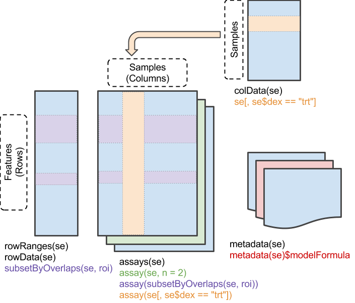
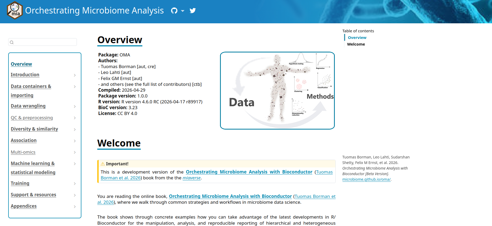

Authors:
    Tuomas Borman^[University of Turku, tvborm@utu.fi]
    <br/>
Last modified: 4 June, 2025.

 

## Overview

### Description

This training session introduces Bioconductor tools for microbiome data science
through a practical case study. It focuses on a framework built around the
`r BiocStyle::Biocpkg("TreeSummarizedExperiment")` data container, designed for improved efficiency,
scalability, and data integration. Participants will gain hands-on experience
with common analysis and visualization methods using the mia package family,
along with other interoperable tools from the Bioconductor ecosystem. After the
session, participants can continue learning through the freely available
["Orchestrating Microbiome Analysis (OMA) online book"](https://microbiome.github.io/OMA/docs/devel/).

### Pre-requisites

To get most of the training session, you should meet the following
pre-requisites. 

- You have a basic understanding of R. You have written simple R scripts or used Quarto/RMarkdown documents.
- You are familiar with Bioconductor.
- You have basic understanding on what the microbiome is.

If your time allows, we recommend to spend some time to explore beforehand
[Orchestrating Microbiome Analysis (OMA) online book](https://microbiome.github.io/OMA/docs/devel/).

### Participation

Participants are encouraged to ask questions throughout the workshop. The
session will follow
[a tutorial](https://microbiome.github.io/OMATutorials/),
with participants running the tutorial alongside the instructor.

To facilitate this, Galaxy & Bioconductor provide
[pre-installed virtual machines with all necessary packages](https://workshop.bioconductor.org/).

### _R_ / _Bioconductor_ packages used

In this training session, we will cover a common methods and packages for
microbiome data science in `r BiocStyle::Biocpkg("SummarizedExperiment")` ecosystem. We will have
specific focus on `r BiocStyle::Biocpkg("mia")`,
which provides essential methods for conducting microbiome analysis.

### Time outline

| Activity                           | Time |
|------------------------------------|------|
| Practicalities and background      | 15m  |
| Trained-guided live coding         | 45m  |
| Time to try things out on your own | 15m  |
| Questions, discussion and recap    | 15m  |

### Learning goals and objectives

#### Questions

- What is _mia_ and _OMA_?
- How microbiome data science is conducted in `r BiocStyle::Biocpkg("SummarizedExperiment")` ecosystem?
- What benefits this new ecosystem have compared to previous approaches?

#### Objectives

- **Analyze and apply methods**:  Apply the `r BiocStyle::Biocpkg("SummarizedExperiment")` ecosystem to process and analyze microbiome data.

- **Create visualizations**: Generate and interpret visualizations.

- **Explore documentation**: Use the [OMA](https://microbiome.github.io/OMA/docs/devel) to explore additional tools and methods.

## Training session

### Background

#### Microbiome data science [@MorenoIndias2021]


#### Microbiome data science in Bioconductor

```{r, results='hide'}
#| label: microbiome_bioconductor
#| fig-width: 15
#| include: false
library(ggplot2)
library(ggrepel)

# Timeline data
timeline_data <- data.frame(
    year = c(2012, 2015, 2017, 2019),
    event = c(
        "phyloseq\nMcMurdie and Holmes, 2013",
        "SummarizedExperiment\nHuber et al., 2015",
        "SingleCellExperiment\nAmezquita et al., 2020", 
        "TreeSummarizedExperiment\nHuang et al., 2021"
    )
)

# Create a single polygon for the entire arrow (rectangle + arrowhead)
arrow_data <- data.frame(
    x = c(2021, 2024.5, 2024.5, 2025, 2024.5, 2024.5, 2021),
    y = c(-0.14, -0.14, -0.16, -0.10, -0.04, -0.06, -0.06)
)

ggplot(timeline_data, aes(x = year, y = 0)) +
    # Base timeline
    annotate(
        "segment", x = 2011, xend = 2025, y = 0, yend = 0,
        arrow = arrow(length = unit(0.4, "cm"), type = "closed"),
        linewidth = 1.5, color = "gray40"
        ) +
    
    # Timeline points and segments
    geom_point(size = 5, color = "#2C3E50") +
    
    # Repelled labels
    geom_label_repel(
        aes(
          label = event),
          direction = "y",
          nudge_y = 0.02,
          box.padding = 0.4,
          point.padding = 0.5,
          size = 5,
          fontface = "bold",
          color = "#34495E",
          segment.color = "gray60"
        ) +
    
    # mia: draw arrow-box from 2021 to 2025
    geom_polygon(
        data = arrow_data,
        mapping = aes(x = x, y = y),
        fill = "white", color = "black", linewidth = 0.8
        ) +
    annotate(
        "text", x = 2022.75, y = -0.10,
        label = "OMA\n(Borman et al., 2025)",
        size = 5, fontface = "bold", color = "black", lineheight = 1.1
        ) +
    
    # Final theming
    scale_x_continuous(
        breaks = c(timeline_data$year, 2021, 2025),
        limits = c(2010, 2025)
        ) +
    scale_y_continuous(limits = c(-0.25, 0.3)) +
    theme_minimal(base_size = 15) +
    theme(
        axis.title = element_blank(),
        axis.text.y = element_blank(),
        axis.text.x = element_text(size = 12),
        axis.ticks = element_blank(),
        panel.grid = element_blank(),
        legend.position = "none",
        plot.title = element_text(face = "bold", size = 16, hjust = 0.5)
    )
```

#### SummarizedExperinent, SE [@Huber2015]



#### TreeSummarizedExperiment, TreeSE [@Huang2021]


#### Ochestrating Microbiome Analysis with Bioconductor (OMA)

<div style="display: flex; gap: 2%; align-items: flex-start;">

<div style="flex: 0 0 70%;">

- [mia](https://bioconductor.org/packages/release/bioc/html/mia.html) (Data analysis)
- [miaViz](https://bioconductor.org/packages/release/bioc/html/miaViz.html) (Visualization)
- [miaSim](https://bioconductor.org/packages/release/bioc/html/miaSim.html) (Simulation)
- [miaTime](https://github.com/microbiome/miaTime) (Time series analysis)
- [miaDash](https://miadash-microbiome.2.rahtiapp.fi/) (Graphical user interface)
- [iSEEtree](https://bioconductor.org/packages/release/bioc/html/iSEEtree.html) (Interactive visualization)
- [Expanded by independent developers](https://microbiome.github.io/OMA/docs/devel/pages/miaverse.html#sec-packages)

**Interoperable with the `r BiocStyle::Biocpkg("SummarizedExperiment")` ecosystem**

</div>

<div style="flex: 0 0 30%;">

{fig-alt="mia logo." width=20%} {fig-alt="MGnifyR logo." width=20%}
{fig-alt="HoloFoodR logo." width=20%}
{fig-alt="iSEE logo." width=20%}
{fig-alt="MAE logo." width=20%}
{fig-alt="SE logo." width=20%}
{fig-alt="SCE logo." width=20%}
{fig-alt="scater logo." width=20%}
{fig-alt="benchdamic logo." width=20%}
{fig-alt="netcomi logo." width=20%}
{fig-alt="radEmu logo." width=20%}
{fig-alt="DESeq2 logo." width=20%}
{fig-alt="Biobakery logo." width=20%}
</div>

</div>

### Trained-guided live coding

#### Start your engines!

- Go to [workshop.bioconductor.org](https://workshop.bioconductor.org/)
- Or prepare your local R session

#### Import data

The curated metagenomic data project provides free access to a collection of
curated microbiome datasets, which are available through the
_curatedMetagenomicData_ R package [@Pasolli2017]. Currently, it contains over
20,000 samples
from 100 studies, which can be imported directly to `TreeSE` format. You can
see the full list of available datasets from
[the documentation](https://waldronlab.io/curatedMetagenomicData/index.html).

Below, we we load a dataset containing 60 samples from healthy controls and
patients with colorectal cancer (CRC).

```{r}
#| label: import_data
#| eval: false
library(curatedMetagenomicData)

res <- curatedMetagenomicData(
    pattern = "GuptaA_2019.relative_abundance",
    dryrun = FALSE,
    rownames = "short"
)
```

Once loaded, we can see that the data includes a list of single
`r BiocStyle::Biocpkg("TreeSummarizedExperiment")` object, which
including taxonomy annotations. We select it from the
list and store it into a variable named `tse`.

```{r}
#| label: import_data2
#| eval: false
tse <- res[[1]]
```

```{r}
#| label: save_data
#| eval: false
#| include: false
saveRDS(tse, "data/GuptaA_2019_tse.rds")
```

```{r}
#| label: read_data
#| eval: true
#| include: false
library(TreeSummarizedExperiment)
tse <- readRDS("data/GuptaA_2019_tse.rds")
```

#### Data container

`r BiocStyle::Biocpkg("TreeSummarizedExperiment")` extends
`r BiocStyle::Biocpkg("SummarizedExperiment")` class by adding a support for
microbiome-specific
datatypes. These include, for instance, `rowTree` slot that can be utilized to
store phylogeny or any other hierarchical presentation of the data. All slots
derived from `r BiocStyle::Biocpkg("SummarizedExperiment")` class are also available in `r BiocStyle::Biocpkg("TreeSummarizedExperiment")`, providing full backward
compatibility.

{width=80%}

```{r}
#| label: print_treese
tse
```

Slots can be accessed with dedicated accessor functions. For instance,
`colData` (sample metadata) can be accessed with `colData()` function.

```{r}
#| label: show_coldata
# Show only first five rows and columns
colData(tse)[1:5, 1:5]
```

#### Data processing

Microbiome data has unique characteristics, meaning that dealing with such data
also poses unique challenges and approaches. The `mia` package provides methods
for performing common operations on microbiome data within the SE ecosystem.

For instance, agglomeration is commonly used to reduce the number of features or
to focus on biologically meaningful subgroups of the data. Agglomeration means
merging data into higher taxonomic levels by summing the abundances of related
taxa.

Below, we agglomerate the data into all available taxonomy levels.

```{r}
#| label: agglomerate
library(mia)

tse <- agglomerateByRanks(tse)
```

At first glance, it might seem that nothing has changed. However, the
agglomerated data is stored in the `altExp` slot. This slot keeps track of the
sample mapping and stores different versions of the data.

We can access data agglomeration into the phylum level with the following
command:

```{r}
#| label: access_phyla
altExp(tse, "phylum")
```

The data looks similar to original data; only the number of rows has changed.
While we could store the phylum-level data in a separate variable, it's better
to keep it in the `altExp` slot, as it maintains consistent sample mapping for
us.

Another data processing step where microbiome analysis has unique approaches is
transformation. Below, we apply centered lo-ratio (CLR) transformation which
respect the compositional nature of microbiome data.

```{r}
#| label: transformation
tse <- transformAssay(
    tse,
    assay.type = "relative_abundance",
    method = "clr",
    pseudocount = TRUE
)
```

The transformed abundance table is stored in the `assay` slot. This slot now
contains two tables: the original abundance table and the CLR-transformed table
We can access the transformed data with the following command:

```{r}
#| label: access_clr

assay(tse, "clr")[1:5, 1:5]
```

#### Community summaries

While `r BiocStyle::Biocpkg("mia")` package include common methods for analysis, `r BiocStyle::Biocpkg("miaViz")` provides
methods for visualizing microbiome data. For instance, we can visualize
abundance of phyla with a bar plot. To compare controls and CRC patients, we can
visualize the groups separately.

```{r}
#| label: plot_abundance
library(miaViz)

# Get phylum-level data
tse_phyla <- altExp(tse, "phylum")

# Create a bar plot
plotAbundance(
    tse_phyla,
    assay.type = "relative_abundance",
    col.var = "disease",
    facet.cols = TRUE,
    scales = "free"
)
```

From the figure, we observe that especially abundance of _Euryarchaeota_ seems
to differ between the groups.

#### Alpha diversity

To summarize the diversity of microbial communities, alpha diversity is commonly
calculated. There are several diversity indices available, all of which measure
the number of distinct taxa and how evenly their abundances are distributed,
each with a different emphasis.

```{r}
#| label: calculate_alpha
tse <- addAlpha(tse, assay.type = "relative_abundance")
```

The results are stored in `colData`. By default, `addAlpha()` returns a set of
indices that considers different aspects of diversity. Below, we visualize
Faith's diversity that assess the phylogenetic diversity of samples.

```{r}
#| label: visualize_alpha
library(scater)

plotColData(tse, x = "disease", y = "faith_diversity")
```

From the figure, we can observe that CRC patients have more diverse microbiomes.
This may suggest that their gut is colonized by microbes that are not typically
present in a healthy gut.

#### Beta diversity

While alpha diversity reflects within-sample diversity, beta diversity measures
diversity between samples. This allows us to assess whether there are patterns
in microbial profiles associated with covariates &mdash; such as diagnosis,
in this case.

Below, we calculate perform principal coordinate analysis (PCoA) also known
as multidimensional scaling (MDS). We apply UniFrac dissimilarity that takes
into account phylogeny.

```{r}
#| label: calculate_mds
tse <- addMDS(
    tse,
    assay.type = "relative_abundance",
    method = "unifrac"
)
```

After calculating the results, we can visualize them with the diagnosis.

```{r}
#| label: visualize_mds
plotReducedDim(tse, dimred = "MDS", colour_by = "disease")
```

We can see clear pattern: microbial profiles of CRC patients are distinct from
healthy controls.

### Time to try things out on your own!

- Go to OMA ([microbiome.github.io/OMA](https://microbiome.github.io/OMA/docs/devel/))
- Navigate to _Differential abundance analysis_ chapter
- Do exercises 1-3
- Explore the book!

<p style="text-align: right;">
  [{width=500px}](https://microbiome.github.io/OMA/docs/devel/){preview-link="true"}
</p>

#### Differential abundance analysis

```{r}
#| label: calculate_daa
#| eval: false
library(maaslin3)

res <- maaslin3(tse, formula = ~ disease, output = "maaslin3_output")
```

```{r}
#| label: visualize_daa
#| eval: false
file_path <- file.path("maaslin3_output", "figures", "summary_plot.png")
knitr::include_graphics(file_path)
```

## Questions, discussion and recap

1. Microbiome data science in `r BiocStyle::Biocpkg("SummarizedExperiment")` ecosystem
2. Scalable and computationally efficient
3. Integration of multi-table and multi-omics datasets

## Thank you for your time!

**Join us!**

- Online book: [microbiome.github.io/OMA](https://microbiome.github.io/OMA/docs/devel/)

- Discussion forums: [github.com/microbiome/OMA/discussions](https://github.com/microbiome/OMA/discussions) and Bioconductor Zulip

 

## Session information

```{r}
#| label: session_info
sessionInfo()
```

## References
